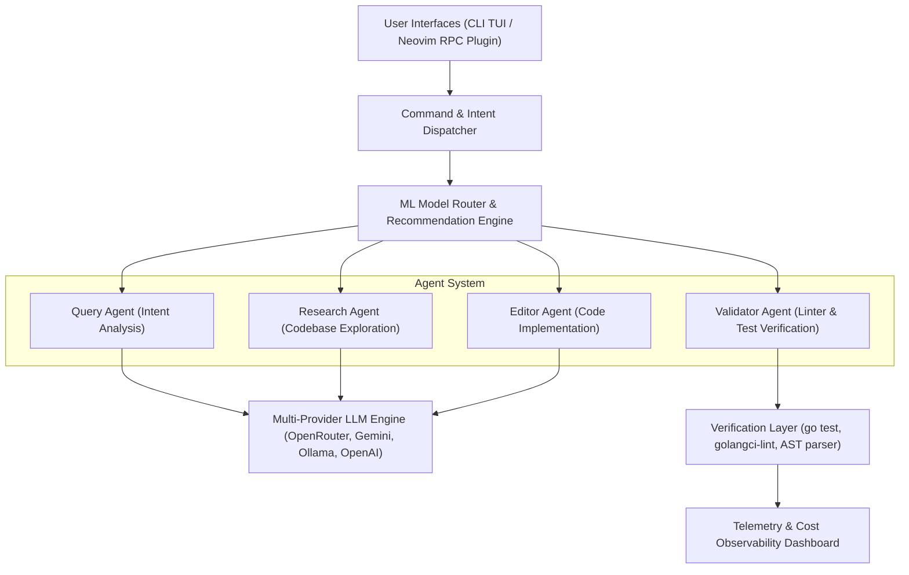

# GPTCode CLI

> Autonomous AI Coding Assistant — **$0-5/month** vs $20-30/month subscriptions

[](https://github.com/jadercorrea/gptcode/actions)
[](https://go.dev)
[](LICENSE)

## System Architecture



## Quick Start (30 seconds)

```bash
# 1. Install
curl -sSL https://gptcode.dev/install.sh | bash

# 2. Quick setup (recommended)
gt setup -y

# 3. Add your free API key
gt key openrouter
# (paste key from https://openrouter.ai/keys)

# 4. Test it!
gt run "hello"
```

## Alternative: Manual Setup

```bash
# Install
curl -sSL https://gptcode.dev/install.sh | bash

# Or using go install
go install github.com/jadercorrea/gptcode/cmd/gptcode@latest

# Guided setup
gt setup
# Choose "1) Quick Start" and paste your API key
```

## Usage

Use `gptcode` or the short alias `gt`:

```bash
# Quick AI answers (no tool loop - fastest)
gt go "what is Go language"
gt go "write hello world in Python"

# Autonomous mode - AI completes the task with tools
gt do "add user authentication"

# Interactive chat
gt chat

# Code review
gt review

# Research mode
gt research "how does the payment system work?"
```

## Commands

| Command | Description |
|---------|-------------|
| `gt go "question"` | Quick AI answer (no tools) - fastest |
| `gt do "task"` | Autonomous task completion with tools |
| `gt chat` | Interactive code conversation |
| `gt run "task"` | Execute with follow-up |
| `gt research "question"` | Document codebase/architecture |
| `gt plan "task"` | Create implementation plan |
| `gt implement plan.md` | Execute plan step-by-step |
| `gt review` | Code review for bugs/security |
| `gt tdd` | Test-driven development mode |
| `gt feature "desc"` | Generate tests + implementation |

## Tools Available

When using autonomous modes (`gt do`, `gt run`, `gt chat`), these tools are available:

| Tool | Description |
|------|-------------|
| `read_file` | Read file contents |
| `list_files` | List files with pattern filter |
| `search_code` | Regex search in code |
| `find_relevant_files` | AI-powered file discovery |
| `write_file` | Create/edit files |
| `apply_patch` | Replace text blocks |
| `run_command` | Execute shell commands |
| `project_map` | Project structure tree |
| `web_search` | Web lookup (requires EXA_API_KEY) |

## Skills

Language-specific guidelines injected into prompts:

```bash
gt skills list              # List available skills
gt skills install ruby      # Install Ruby skill
gt skills install-all       # Install all skills
gt skills show go           # View skill content
```

Available: Go, Elixir, Ruby, Rails, Python, TypeScript, JavaScript, Rust

## Configuration

```bash
gt setup                    # Initialize ~/.gptcode
gt key groq                 # Set API key
gt backend use groq         # Switch backend
gt profile use groq.speed   # Switch profile
```

## Why GPTCode?

- **Cost**: $0-5/month using Groq/OpenRouter free tiers
- **Model Selection**: Intelligent routing to best model per task
- **Skills**: Language-specific guidelines for idiomatic code
- **E2E Encryption**: Your code never stored on our servers

## Documentation

- [Installation Guide](https://gptcode.dev/guides/installation)
- [Configuration](https://gptcode.dev/guides/configuration)
- [Skills Index](https://gptcode.dev/skills)
- [API Reference](https://gptcode.dev/reference)

## License

MIT
